# pcbforge workflow

This is the operational summary of the pcbforge board-development process.
[`DESIGN.md`](DESIGN.md) remains the authoritative contract; the agent
playbooks contain the detailed procedures for individual phases.

## Overview

```mermaid
flowchart LR
    SPEC[SPEC] --> INIT[init]
    INIT --> ARCH[ARCHITECT]
    ARCH -->|User approval| MCU[MCU]
    MCU --> IMPLEMENT[IMPLEMENT]
    IMPLEMENT --> BUILD[build + test]
    BUILD --> BRIEF[brief]
    BRIEF --> LAYOUT[LAYOUT]
    LAYOUT --> ROUTE[ROUTE]
    ROUTE --> VERIFY[verify]
    VERIFY --> FAB[fab-out]
    FAB --> ORDER[order]
    ORDER --> PUBLISH[publish]

    classDef user fill:#f6d365,stroke:#8a6500,color:#111;
    classDef agent fill:#9fd3ff,stroke:#23618f,color:#111;
    classDef tool fill:#b8e6bf,stroke:#357a40,color:#111;

    class SPEC,ARCH,MCU,IMPLEMENT,BRIEF,PUBLISH agent;
    class INIT,BUILD,VERIFY,FAB tool;
    class LAYOUT,ROUTE,ORDER user;
```



Blue phases are primarily AI-led, green phases are deterministic tooling, and
yellow phases are owned by the user. ARCHITECT has mandatory proposal and final
user-approval gates. CubeMX review during MCU is optional.

## Decision authority

The AI may derive consequences of approved requirements, but it may not choose
between materially different reasonable designs. When alternatives affect
topology, interfaces, connectors, resources, cost, risk, reversibility, or user
experience, the AI presents the options, recommendation, tradeoffs, and
consequences, then stops before changing the affected artifact.

Approval is never inferred from silence, general permission to continue, or a
broad implementation request. The AI may record approval already expressed by
the user, but may not originate or self-approve it. Proposal approval precedes
implementation; final approval follows presentation and validation. Approval
events carry artifact fingerprints. When an approved artifact changes, static
status reports the approval stale and the next checked dashboard write records
a durable reopen event; rerunning checks cannot revive that approval.

## Manufacturing and technology policy

Schema-10 projects pair the requirements in `spec.md` with a tracked
`policy.yaml`. The tool-owned `policies/pcbforge-standard-v1.yaml` profile
defines hard rules, defaults, exception rule IDs, and the earliest phase each
exception affects. `.pcbforge` pins the profile and hash.

JLCPCB fabrication/assembly, STM32, 2/4 layers, SWD, pinned tools, exact part
identity, official commodity libraries, spatial ownership, and human ordering
authority are hard constraints. Standard FR4 1.6 mm / 1 oz construction,
conventional vias, no controlled impedance, 0603 minimum ordinary R/C/LED, and
avoidance of BGA/WLCSP/sub-0.5-mm QFN are defaults with explicit exception
gates. Protection, testability, marking, and sourcing evidence live in the
project contract.

`policy.yaml` may request an exception but cannot approve itself. After the
user accepts the presented tradeoff, the agent records the artifact-bound
decision with `pcbforge policy approve-exception <id> --note "..."`. Changed
exceptions become stale and durably reopen their mapped phase. Normal policy
checks are offline.

## Phases

| Phase | Lead | Durable output | Gate or completion condition |
|---|---|---|---|
| 1. SPEC | AI interview; user decides intent | Approved `spec.md`, initial `policy.yaml`, and tracked `STATUS.md` | Explicit SPEC completion event bound to spec and policy baseline |
| 2. init | Tool | Project scaffold, pinned metadata, policy/rule profiles, KiCad shell, project-local `AGENTS.md` | Current artifact-bound SPEC/policy approval exists and the scaffold smoke-builds |
| 3. ARCHITECT | AI proposes; user approves twice | Approved graph in `docs/architecture.md`, then compiling functional skeleton in `src/` | Artifact-bound proposal approval before code and separate final approval after build/audit |
| 4. MCU | AI; optional user CubeMX review | Checked `firmware/<project>.ioc` and matching `src/mcu.ato` | Pinmux validates and MCU code passes a one-to-one audit |
| 5. IMPLEMENT | AI | Physical module bodies, selected parts, values, footprints, sourcing, assurances, and constraints | Current build, parts, IOC, and policy checks pass |
| 6. build + test | Compiler and checks | Exact `build-test.yaml`, resolved BOM/connectivity, assertions, and tracked `docs/build-test.md` | Frozen build and every deterministic acceptance check pass with current fingerprints |
| 7. brief | Tool and AI; user approves | Exact `placement.yaml`, generated `brief.md`, and PCBForge-owned KiCad net classes | Contract check passes and user approves the brief plus schematic presentation |
| 8. LAYOUT | User | Component placement in KiCad | User considers placement complete |
| 9. ROUTE | User | Routed copper in KiCad | User considers routing complete |
| 10. verify | Tools and AI | DRC, scripted audits, and render review | Manufacturing and layout checks pass |
| 11. fab-out | Tool | JLCPCB Gerbers, drills, BOM, CPL, and upload archive | Outputs regenerate cleanly from the project |
| 12. order | User | Fabrication order | User reviews files, confirms current post-FAB sourcing, uploads, and authorizes spending |
| 13. publish | AI prepares; user curates | Proven reusable module, version, documentation, and render | Module has real-board evidence and a stable interface |

## 1. SPEC

The AI follows `agent/spec-interview.md` and interviews the user about purpose,
power, rails, MCU family, peripherals, connectors, dimensions, layer count,
debugging, quantity, cost, and special constraints.

The result is `spec.md` plus `policy.yaml`:

- YAML frontmatter is the machine-readable initialization contract.
- Markdown prose records intent, reasoning, risks, and decisions.
- The user explicitly approves the baseline before initialization.
- The policy records construction/package defaults, applicability decisions,
  later evidence slots, and any requested exceptions without claiming approval.

Once the draft validates, the agent runs `pcbforge status --write` to create
`STATUS.md`. After the user explicitly approves the baseline in conversation,
the agent records that already-given approval with
`pcbforge status mark spec complete --note "..."`. These status commands are
the persistence mechanism, not the user interaction; the user does not need to
run them in the normal workflow. Initialization preserves and refreshes the
dashboard.

SPEC's user interface is the conversation; there is no `pcbforge spec`
command.

## 2. init

Run:

```bash
pcbforge init
```

Initialization is create-only. It first requires a current fingerprinted
SPEC/policy approval event; an absent, legacy-unbound, stale, or policy-invalid
approval is rejected. It then validates both contracts, creates the atopile
project, KiCad 9 board shell, JLC rules, output directories, firmware
directory, pinned `.pcbforge` metadata, and project-local `AGENTS.md`. The
scaffold is installed only after a successful compiler smoke test.

Reinstalling pcbforge is not required for an existing checkout. Existing
projects are never reinitialized to adopt workflow changes.

## 3. ARCHITECT

The AI follows `agent/architect.md` and converts the approved requirements into
a compiling functional graph:

- power tree and every required rail;
- generic MCU boundary;
- functional modules and external connectors;
- typed interfaces such as power, I²C, SPI, UART, USB, CAN, and SWD;
- one-to-one coverage of the specification.

ARCHITECT deliberately excludes exact parts, component values, footprints, MCU
pins, CubeMX configuration, placement, routing, and other spatial board data.

The AI creates `docs/architecture.md` before writing the skeleton. Its Mermaid
`flowchart LR`
shows each functional module, external boundary, and top-level typed
connection exactly once. It represents architecture, not an electrical
schematic: parts, values, footprints, MCU pins, CubeMX data, placement, and
routing are excluded. If more than one material graph satisfies the spec, the
AI presents the alternatives and stops. The user explicitly approves the
proposal before source work begins:

```bash
pcbforge status mark architect proposal-approved \
  --note "Approved graph and material choices; diagram: docs/architecture.md"
```

The proposal approval is bound to `spec.md` and `docs/architecture.md`. A
change to either requires renewed proposal approval before coding continues.
On schema-9-and-newer projects, the dashboard also reports ARCHITECT blocked when source
skeleton files appear before a current proposal approval.

After the final build, the AI audits the diagram against the top-level `App`
instances, typed connections, and spec boundaries. The review package contains
the tracked diagram rendered inline, interface table, requirement coverage,
reuse status, audit, risks, source diff, and build result.

The workflow cannot continue until the user separately approves the compiled
and audited architecture and the agent records a STATUS completion event
referencing `docs/architecture.md`. Final approval is bound to `spec.md`, the
diagram, and the thin top-level `src/main.ato` graph. Later module-graph or
public-interface changes invalidate the approval, durably reopen ARCHITECT on
the next dashboard write, and require both approval gates again.

## Living status dashboard

`STATUS.md` is the single tracked dashboard for all 13 phases. Its generated
body shows the current phase, completed required-phase count, blockers, next
actions, phase-by-phase evidence, and recent events. Its frontmatter stores
append-only, artifact-bound phase and policy gates plus fingerprinted build,
parts-policy, technology-policy, build-test, placement-brief, IOC, and DRC
results.

- `pcbforge status` is a fast, read-only inspection.
- `pcbforge status --write` refreshes the document without running slow tools.
- `pcbforge status --check --write` refreshes applicable pinned validations.
- `pcbforge status mark <phase> <action> --note "..."` records explicit
  ARCHITECT proposal approval, completion, blocker, reopen, or
  optional-publish skip events.
- `pcbforge check-policy` validates the current policy scope.
- `pcbforge policy approve-baseline`, `approve-exception`, and
  `confirm-sourcing` persist explicit user decisions in a separate append-only
  policy-event stream.

Mechanical phases cannot complete without current evidence. Human-owned phases
cannot complete from file heuristics alone. Reopening an earlier phase makes
older downstream confirmations stale until they are reconfirmed.

## 4. MCU

The AI follows `agent/mcu.md`:

1. Convert the approved MCU interface into a peripheral and resource checklist.
2. Select the exact orderable STM32 and package.
3. Ask the user only when a material tradeoff remains.
4. Allocate pins, peripheral modes, clocks, DMA/timer resources, SWD, and the
   optional debug UART.
5. Create the authoritative `firmware/<project>.ioc`.
6. Run `pcbforge check-ioc`.
7. Present the selected part, pin table, clocks, spare resources, assumptions,
   and sourcing evidence.
8. Offer optional review in CubeMX 6.18.

If the user saves changes from CubeMX, those changes are deliberate overrides.
The AI shows the semantic difference, reruns `check-ioc`, and reconciles every
derived artifact.

`ioc2code` is not implemented yet. Until it exists, the AI derives
`src/mcu.ato` manually from the checked `.ioc` and performs the explicit
one-to-one audit in the MCU playbook.

## 5–7. IMPLEMENT, build + test, and brief

During IMPLEMENT, the AI replaces architecture placeholders with physical
circuit definitions: exact components, values, footprints, LCSC identifiers,
decoupling, pull resistors, protection, and electrical constraints.

The AI follows `agent/implement.md`. Commodity resistors, capacitors, and LEDs
reuse compiler primitives plus canonical official KiCad symbols and footprints;
the exact MPN and LCSC number remain supplier/BOM metadata. Project-local KiCad
assets are reserved for packages or pin mappings absent from the official
libraries. `pcbforge check-parts` blocks recognized commodity duplicates and is
required, current evidence for IMPLEMENT completion.

The AI also completes `policy.yaml` assurances and records sourcing evidence
for each LCSC item. `pcbforge check-policy` detects ordinary packages below
0603, undeclared advanced packages/processes, missing assurance evidence, BOM
sourcing gaps, and stale or absent exception approval. `build`, `parts`,
`policy`, and `ioc` must all be current for IMPLEMENT completion.

Step 6 follows `agent/build-test.md`. The AI writes `build-test.yaml` from the
reviewed implementation: exact LCSC/MPN/footprint/quantity lines, expected PCB
footprint total, and stable IDs for every required atopile assertion. Source
markers such as `# pcbforge-test: rail-3v3-tolerance` bind those IDs to the
assertions the pinned compiler executes.

`pcbforge check-build-test` runs a frozen build and validates the compiler
manifest and BOM artifacts, exact BOM selection, BOM-to-PCB designator parity,
resolved pad-to-net connectivity, and the expected footprint total. It also
compares the PCB before and after the no-op build and fails if footprint
placement, tracks, vias, zones, outline, graphics, or other user-owned spatial
content changes.

`pcbforge status --check --write` saves the stable tracked
`docs/build-test.md` evidence report and its input fingerprint in `STATUS.md`.
Step 6 completes automatically only while both are current. A failed run never
overwrites the last passing report.

This offline gate deliberately excludes live stock/pricing, visual schematic
adequacy, placement, routing, KiCad DRC, and fabrication output. Those remain
their documented later or manual reviews.

Step 7 follows `agent/brief.md`. The AI writes authoritative
`placement.yaml` schema 1 from reviewed circuit intent, datasheets, mechanics,
and the resolved Step 6 PCB topology. It defines:

- a qualitative board strategy and board-wide rules;
- ordered placement groups that cover every PCB footprint exactly once;
- typed proximity, separation, board-edge, keepout, orientation,
  accessibility, and airflow constraints using exact `REF` or `REF.PAD`
  endpoints;
- one or more routing net classes using exact existing PCB net names and
  conservative track, clearance, via, drill, annular, and optional
  differential-pair dimensions;
- a final human layout checklist.

`pcbforge brief` requires current Step 6 evidence, validates the complete
contract against current references, pads, nets, and the pinned JLC profile,
then atomically generates `brief.md` and merges only classes named
`pcbforge:<name>` plus their exact patterns into `<project>.kicad_pro`. It
preserves Default and user-created classes, assignments, unknown project
settings, and the entire design-rules file. It verifies that
`<project>.kicad_pcb` remains byte-identical and never creates keepout
geometry, coordinates, placement, or copper.

`pcbforge check-brief` performs the same validation without writing. Step 7
stores this check in `STATUS.md`, but passing machine evidence is not approval:
the user reviews generated `brief.md` and the best available schematic
presentation. Completion requires an explicit STATUS note referencing
`brief.md` and containing `schematic review: adequate`. If that presentation
cannot support confident circuit review, Step 7 is blocked and layout must not
begin.

Step 6 and Step 7 fingerprints use circuit-owned PCB topology—reference,
footprint, pad, and net membership—not coordinates, sides, tracks, vias, zones,
outline, graphics, or user artwork. Circuit/topology changes stale both gates;
ordinary layout and routing edits do not. Changes to `placement.yaml`,
`brief.md`, or PCBForge-owned net-class settings stale Step 7, while unrelated
user KiCad classes do not.

## 8–9. LAYOUT and ROUTE

The user owns all placement and routing in KiCad 9. These files are the spatial
source of truth.

The AI may inspect renders and measurements, identify risks, and provide
written suggestions when asked. It must never move footprints, draw tracks,
change zones, or silently rewrite human spatial work.

## 10–12. verify, fab-out, and order

Verification combines:

- KiCad DRC using the pinned CLI;
- pcbforge electrical and manufacturing audits;
- AI review of board renders;
- confirmation that requested JLCPCB constraints are satisfied.

`fab-out` creates the Gerbers, drill files, BOM, CPL, and upload archive. The
tool stops before any external upload or purchase.

The user reviews the final package, uploads it to JLCPCB, and authorizes all
ordering and spending. Before ORDER, live JLC availability and lifecycle
evidence is refreshed after the current FAB-OUT package. The user explicitly
confirms that review with `pcbforge policy confirm-sourcing`; its fingerprint
binds the sourcing records, Step 6 BOM, and fabrication outputs.

## 13. publish

A project-local module becomes eligible for publication only after it has been
proven on a real board. Publishing records its provenance, freezes or versions
its public interfaces, creates documentation and a render, and adds it to the
module index.

Publishing is curated rather than automatic. The user may decline publication
or request presentation cleanup without changing the proven circuit.

## Current automation boundary

Implemented now:

- pinned atopile, KiCad 9, and CubeMX 6.18 wrappers;
- SPEC, ARCHITECT, MCU, IMPLEMENT, and build + test agent playbooks;
- AI-generated tracked Mermaid architecture artifacts;
- `pcbforge init`;
- `pcbforge check-ioc`;
- `pcbforge check-parts` and its IMPLEMENT completion gate;
- schema-10 policy profiles/contracts, `pcbforge check-policy`, explicit
  baseline/exception/sourcing approvals, targeted reopening, and
  `pcbforge migrate-policy`;
- `pcbforge check-build-test`, exact Step 6 contracts, tracked reports, and
  dashboard completion gate;
- `pcbforge brief` / `pcbforge check-brief`, strict Step 7 contracts,
  generated briefs, safe KiCad net-class seeding, and explicit approval gate;
- compiler builds and current pilot checks.

Still manual or future tooling:

- `ioc2code`;
- compiler-derived architecture-diagram generation and validation;
- complete verification audits;
- `fab-out`, automated live stock lookup, and module publishing commands.

The workflow remains valid while these commands are developed, but the AI must
state clearly whenever it is performing a documented step manually.
