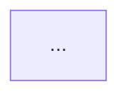

<!-- pcbforge-architect-schema: 3 -->
# pcbforge — ARCHITECT playbook

This playbook operationalizes the ARCHITECT phase in
[`DESIGN.md`](../DESIGN.md). The AI leads, the user approves, and the pinned
compiler validates. ARCHITECT defines the circuit's functional boundaries; it
does not select or implement physical parts.

## Preconditions

1. Read the project-local `AGENTS.md`, the complete `spec.md`, `STATUS.md`,
   and `agent/operating-manual.md`.
2. Confirm `.pcbforge`, `ato.yaml`, `src/main.ato`, and the named KiCad board
   exist.
3. Run the pinned `scripts/ato build` from the project directory. Stop and
   diagnose a failing initialized scaffold before proposing architecture.
4. Hash the KiCad board before architecture edits. The board must remain
   unchanged throughout this phase.

## Discover requirements and reuse

Build a coverage checklist from both spec frontmatter and prose:

- power input and every rail;
- MCU family and system responsibilities, without choosing the exact part;
- SWD always, plus debug UART when enabled;
- every peripheral and connector;
- board-level special constraints and open risks.

Inspect `modules/index.md` in the pcbforge tool repository. For every candidate,
show its indexed render and explain the fit. The catalog is initially empty:
say so and propose project-local modules from scratch. A `modules_planned`
entry is not reusable unless it exists in the index. Never invent an import,
version, capability, or render.

Ask the user before coding when an unresolved choice changes power topology,
module boundaries, bus allocation, connector behavior, or the MCU interface
contract. Do not ask about details already settled by the spec.

## Write the code skeleton

- Keep `src/main.ato` as a thin `App` that imports, instantiates, and connects
  blocks.
- Put functional blocks in `src/modules/<snake_case>.ato`, using PascalCase
  module names and snake_case instances.
- Reserve `src/mcu.ato` for an interface-only `Mcu` placeholder. The AI-led
  MCU phase replaces its body from a checked `.ioc` while preserving the
  approved public contract.
- Give each module one clear responsibility. Connect modules with typed
  interfaces, not naming conventions:

| Spec boundary | Preferred atopile interface |
|---|---|
| Input and power rails | `ElectricPower` |
| I²C / SPI / UART | `I2C` / `SPI` / `UART` |
| USB full-speed | `USB2_0_IF` |
| CAN | `CAN` |
| SWD | `SWD` |
| ADC / DAC / PWM | `ElectricSignal`, or `Electrical` only when unavoidable |
| `other` | Clarify before defining the boundary |

Encode only interface constraints already established by the spec. Connectors
are boundaries during ARCHITECT, not selected components.

Do not add physical components, footprints, LCSC numbers, passive values,
exact MCU pins, CubeMX output, copper, placement, routing, zones, or board
geometry. Do not hide implementation decisions inside placeholder modules.

## Maintain the architecture diagram

Create `docs/architecture.md` when the proposed module graph first becomes
concrete, before or alongside writing the skeleton. It is a tracked review
artifact derived from the architecture source; `src/` remains authoritative.
Update the diagram whenever an instance, boundary, or typed connection changes.

The artifact contract is:

````markdown
<!-- pcbforge-architecture-diagram-schema: 1 -->
# <project> architecture

> Architecture only: functional modules and typed interfaces. No parts, values,
> footprints, MCU pins, CubeMX configuration, placement, or routing.

## Functional graph



## Legend

- Project-local module
- Reused module
- Generic MCU boundary
- External boundary
````

Build the Mermaid graph using these rules:

- use `flowchart LR`;
- derive functional node IDs from top-level `App` instance names;
- prefix external-boundary IDs with `ext_`;
- show every functional module and required external connector boundary once;
- show every top-level typed connection once;
- label each edge with its logical role and interface type;
- direct power from source to consumer, use bidirectional edges for buses,
  direct a signal only when its direction is established, and otherwise use a
  neutral edge;
- distinguish project-local, reused, generic-MCU, and external nodes with
  semantic Mermaid classes and with labels or shapes, never color alone.

Do not expand the graph into net-level wiring or add information not present in
the spec and architecture source. The diagram may be rendered inline for
review, but the tracked Markdown is the durable artifact.

## Validate and present

Run the pinned compiler after writing the skeleton. Require:

- successful compilation using atopile `0.15.7`;
- every spec requirement mapped exactly once in the coverage checklist;
- SWD present and debug UART consistent with the spec;
- no physical parts or footprints emitted;
- the KiCad board hash and spatial fingerprint unchanged.

Perform an explicit source-to-diagram audit:

- every functional top-level `App` instance has exactly one node;
- every top-level typed connection has exactly one edge;
- every required external boundary is represented;
- every diagram node and edge is backed by the source or spec;
- no forbidden implementation detail appears.

Present one review package:

1. the tracked `docs/architecture.md` Mermaid graph, rendered inline;
2. module responsibility and typed-interface table;
3. spec-to-module coverage checklist;
4. reused versus new modules, with indexed renders when any exist;
5. unresolved risks and explicit tradeoffs;
6. source-to-diagram audit;
7. meaningful source diff and compiler result.

Ask for explicit architecture approval and stop. Rejection means revise only
the skeleton and diagram, then repeat the build and audit.

After approval, record the durable workflow gate:

```bash
<pcbforge-root>/scripts/pcbforge status mark architect complete \
  --note "<one-line module graph summary and key choice>; diagram: docs/architecture.md"
```

The STATUS event is the authoritative approval gate across sessions. Keep
design rationale in the `spec.md` Decisions log when it is useful, but do not
use prose as workflow state. A later change to the module graph or a public
interface requires `status mark architect reopened`, an updated diagram, and
renewed approval. Report that the next phase is the AI-led MCU workflow in
`agent/mcu.md` and do not begin it without a new user request.
