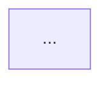

<!-- pcbforge-architect-schema: 1 -->
# pcbforge — ARCHITECT playbook

This playbook operationalizes the ARCHITECT phase in
[`DESIGN.md`](../DESIGN.md). The AI leads, the user approves, and the pinned
compiler validates. ARCHITECT defines the circuit's functional boundaries and
locks the exact MCU configuration through its MCU workstream. Other physical
parts remain CIRCUIT work.

## Preconditions

1. Read the project-local `AGENTS.md`, the complete `spec.md`, `STATUS.md`,
   and `agent/operating-manual.md`.
2. Confirm `.pcbforge`, `ato.yaml`, `src/main.ato`, and the named KiCad board
   exist.
3. Run the pinned `scripts/ato build` from the project directory. Stop and
   diagnose a failing initialized scaffold before proposing architecture.
4. Hash the KiCad board before architecture edits. The board must remain
   unchanged throughout this phase.

## Discover requirements and reuse

Build a coverage checklist from both spec frontmatter and prose:

- power input and every rail;
- MCU family, exact device/package candidates, and system responsibilities;
- SWD always, plus debug UART when enabled;
- every peripheral and connector;
- board-level special constraints and open risks.

Inspect `modules/index.md` in the pcbforge tool repository. For every candidate,
show its indexed render and explain the fit. The catalog is initially empty:
say so and propose project-local modules from scratch. A `modules_planned`
entry is not reusable unless it exists in the index. Never invent an import,
version, capability, or render.

Ask the user before coding when an unresolved choice changes power topology,
module boundaries, bus allocation, connector behavior, or the MCU interface
contract. Do not ask about details already settled by the spec.

An unresolved choice exists whenever two materially different reasonable
architectures satisfy the approved spec. The agent may recommend one, but it
may not silently choose between them. Present the alternatives, recommendation,
tradeoffs, and downstream consequences, then stop for the user. Silence,
general permission to continue, and a request to implement the workflow are not
architecture approval.

## Proposal approval before code

Draft `docs/architecture.md` and `docs/mcu.md` before writing the module
skeleton, IOC, or MCU source. The first is the proposed functional graph. The
second records the exact STM32/package, peripheral allocation, provisional pin
and resource plan, sourcing, material options, recommendation, and unresolved
risks. Follow `agent/mcu.md` for that companion artifact. Do not write or
revise architecture source or `firmware/<project>.ioc` until the user
explicitly approves both proposal artifacts.

Generate and present the exact proposal packet first:

```bash
<pcbforge-root>/scripts/pcbforge status review architect --stage proposal
```

After explicit proposal approval, record that exact fingerprint:

```bash
<pcbforge-root>/scripts/pcbforge status approve architect --stage proposal \
  --fingerprint <sha256> \
  --note "<user-approved graph and material choices>; diagram: docs/architecture.md"
```

This approval is bound to the semantic SPEC contract plus the current
`docs/architecture.md` and `docs/mcu.md` fingerprints. A normative SPEC change
or a change to either proposal artifact invalidates it and requires another
presentation and approval before coding continues. Appending rationale to the
exact `## Decisions log` section does not; all other SPEC prose remains
normative.

Creating architecture source before the first proposal approval makes the
dashboard report ARCHITECT blocked. If source was legitimately created under an
earlier proposal approval and that proposal later becomes stale, the changed
proposal may be presented for renewed approval with the existing source still
present. Stop source changes while renewal is pending; only resume
implementation after the renewed proposal fingerprint is explicitly approved.

## Write the code skeleton

- Keep `src/main.ato` as a thin `App` that imports, instantiates, and connects
  blocks.
- Put functional blocks in `src/modules/<snake_case>.ato`, using PascalCase
  module names and snake_case instances.
- Derive `firmware/<project>.ioc` and `src/mcu.ato` from the approved MCU plan,
  following `agent/mcu.md` and preserving every approved public interface.
- Give each module one clear responsibility. Connect modules with typed
  interfaces, not naming conventions:

| Spec boundary | Preferred atopile interface |
|---|---|
| Input and power rails | `ElectricPower` |
| I²C / SPI / UART | `I2C` / `SPI` / `UART` |
| USB full-speed | `USB2_0_IF` |
| CAN | `CAN` |
| SWD | `SWD` |
| ADC / DAC / PWM | `ElectricSignal`, or `Electrical` only when unavoidable |
| `other` | Clarify before defining the boundary |

Encode only interface constraints already established by the spec. Connectors
are boundaries during ARCHITECT, not selected components.

Do not add non-MCU physical components, LCSC numbers, passive values, copper,
placement, routing, zones, or board geometry. Exact MCU pins and CubeMX output
are permitted only after proposal approval and must match `docs/mcu.md`.

## Maintain the architecture diagram

After proposal approval, treat `docs/architecture.md` as the approved
architecture contract while creating the skeleton. `src/` remains
authoritative for executable capture, but every instance, boundary, or typed
connection change must first be reflected in the diagram and reapproved before
the corresponding source change.

The artifact contract is:

````markdown
<!-- pcbforge-architecture-diagram-schema: 1 -->
# <project> architecture

> Architecture only: functional modules and typed interfaces. No parts, values,
> footprints, MCU pins, CubeMX configuration, placement, or routing.

## Functional graph



## Legend

- Project-local module
- Reused module
- Generic MCU boundary
- External boundary
````

Build the Mermaid graph using these rules:

- use `flowchart LR`;
- derive functional node IDs from top-level `App` instance names;
- prefix external-boundary IDs with `ext_`;
- show every functional module and required external connector boundary once;
- show every top-level typed connection once;
- label each edge with its logical role and interface type;
- direct power from source to consumer, use bidirectional edges for buses,
  direct a signal only when its direction is established, and otherwise use a
  neutral edge;
- distinguish project-local, reused, generic-MCU, and external nodes with
  semantic Mermaid classes and with labels or shapes, never color alone.

Do not expand the graph into net-level wiring or add information not present in
the spec and architecture source. The diagram may be rendered inline for
review, but the tracked Markdown is the durable artifact.

## Validate and present

Run the pinned compiler after writing the skeleton. Require:

- successful compilation using atopile `0.15.7`;
- every spec requirement mapped exactly once in the coverage checklist;
- SWD present and debug UART consistent with the spec;
- a passing CubeMX round trip and one-to-one IOC-to-`src/mcu.ato` audit;
- only the approved MCU boundary and support contract emitted;
- the KiCad board hash and spatial fingerprint unchanged.

Perform an explicit source-to-diagram audit:

- every functional top-level `App` instance has exactly one node;
- every top-level typed connection has exactly one edge;
- every required external boundary is represented;
- every diagram node and edge is backed by the source or spec;
- no forbidden implementation detail appears.

Assemble one final technical package for the checked transition:

1. the tracked `docs/architecture.md` Mermaid graph, rendered inline;
2. `docs/mcu.md`, exact device/package, and final pin/resource table;
3. module responsibility and typed-interface table;
4. spec-to-module coverage checklist;
5. successful CubeMX round trip and one-to-one MCU audit;
6. unresolved risks and explicit tradeoffs;
7. source-to-diagram audit, meaningful diff, and compiler result.

Do not request a second ARCHITECT approval. The proposal approval already owns
the material graph and MCU choices; successful implementation of that proposal
is a checked transition. After completing and reporting the audits, run:

```bash
<pcbforge-root>/scripts/pcbforge finish-architect
```

`finish-architect` requires the current proposal approval, passing build and
IOC checks, an unchanged spatial board, and successful capture of
`review/circuit/source-baseline.json`. It records the
`architecture-baseline` transition and opens CIRCUIT. On failure it records a
precise blocked transition; resolve that failure and rerun the command.

Keep design rationale in the `spec.md` Decisions log when useful, but do not
use prose as workflow state. A later change to the module graph, exact MCU,
resource plan, pin mapping, or public interface requires an updated proposal,
renewed proposal approval, and an updated implementation and audit before
rerunning `finish-architect`. The checked transition captures the pre-CIRCUIT
baseline and opens CIRCUIT directly.
